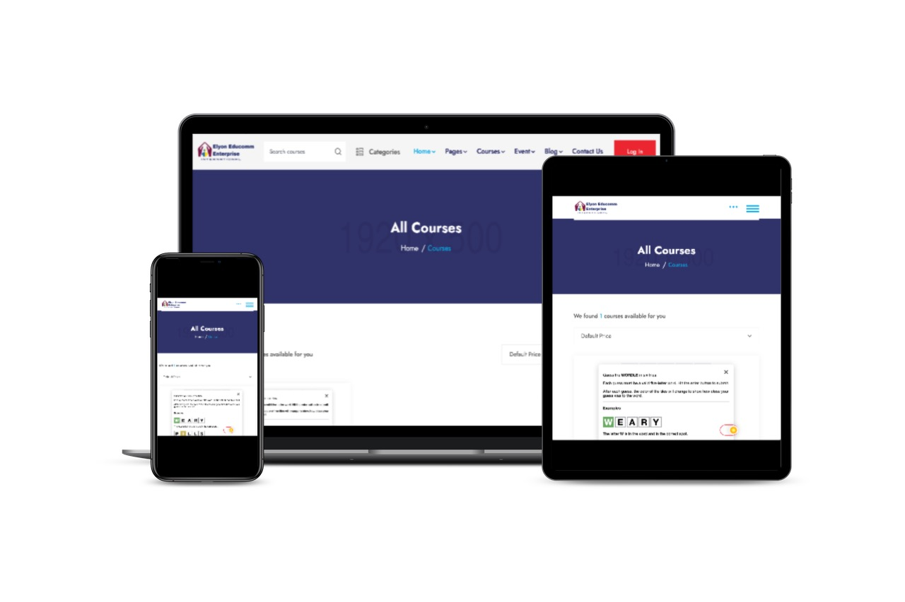

# Elyon Educomm Enterprise

# PROJECT IDEA TITLE :ELYON GLOBAL LEARNING HUB | We provide both accredited and non accredited vocational courses that meets your individual need within your budget and affordable

Ongoing research in the field of Providing the different kind of online courses through this platform:

- Its easy way to learn or gain knoweledge anywhere in world through online platform.
- Online course platform will provide all learning materials 
- Easy to connect with tutors and solve the real time problems.
- provide both accredited and non accredited vocational course that meets your individual needs within your budget and affordability.

(https://github.com/GraceObaEllyone/Elyon-Global-Learning-Hub/) is an online course provider platform by Elyon Educomm Enterprise, which offers courses with certification by well-known awarding bodies and all related learning materials, nevertheless, also provides the support systems where students can be get the feedback on their progress.
The Elyon Educomm Enterprise also publish the blog on the realted all courses to give all kind of knoweledhe about the course where any users can leave there feedback.

This image is created with [smartmockups.com](http://smartmockups.com/).

## Table of Contents

1. [UX](#ux)
    - [Project Goals](#project-goals)
    - [User Stories](#user-stories)
    - [Design](#design)

2. [Features](#features)
    - [Existing Features](#existing-features)
        - [Landing Page](#landing-page)
        - [Courses Page](#course-page)
        - [Cart Page](#cart-page)
        - [Checkout Page](#checkout-page)
        - [Blog Page](#blog-page)
        - [Profiles Page](#profiles-page)
        - [Admin Product Managment](#admin-product-managment)
        - [Django allauth features](#django-allauth-features)
    - [Features Left to Implement](#features-left-to-implement)
    - [Defensive Design](#defensive-design)

3. [Information Architecture](#information-architecture)
    - [Database Choice](#database-choice)
    - [Data Modeling](#data-modeling)

4. [Technologies Used](#technologies-used)
    - [Languages](#languages)
    - [Libraries and Packages](#libraries-and-packages)
    - [Tools](#tools)
    - [Databases](#databases)

5. [Testing](#testing)

# UX
## Project Goals
### Target Audience
- Students who are looking to learn new skill online.
- People who don't have time to go physically in classes to learn new skill.
- People who wants to up-skill while in full-time a=or part-time employment.
- Students who wants to spend less time and less money for getting new learning sets.
- People who are interested in reading blog in short term of time or share the knoweledge with the other peoples.
- Users who want a reliable and trustworthy orgnisation with 5 stars feedback guarantee to sign up to gain new skills

### Visitor / User Goals
- User/Students can get the review feedback or they can check the quality of course before purchasing it.
- Book the course in easy and secure way with extra security majors.
- Gain the knoweldge about the different kind of the skills using the articles provide by different users. 
- Users can share the knowedlge with other users by writing the blog.

<a href="#table-of-contents">Back to top</a>

## User Stories

- Viewing and Navigation

| AS A/AN     | I WANT TO BE ABLE TO ... | SO THAT I CAN... |
| ----------- | ----------- | ----------- |
| Website User/ Student | access the website with any devices | Use the website anytime and anywhere |
| Student | Easily see what services are offered | Find the service I want to use |  
| Student | All the important services are accesible from nav bar| Don't need to scroll to find important information |
| Student | Have a booking cart icon on nav bar | Always check the current order and checkout when I want |

 

- Registration, User Accounts and User Community

| AS A/AN     | I WANT TO BE ABLE TO ... | SO THAT I CAN... |
| ----------- | ----------- | ----------- |
| Website User | Easily register for an account | Have a personal account where I can edit my information |  
| Website User | View my course history | I cant book same course again |
| Website User | Easily recover my password in case I forget it | Recover access to my account |
| Website User | Receive an email confirmation after registering | Verify that my account registration was successful |
| Admin | Post a blog about Different area of learning | Give site visitors interesting information of diffent skills |
| Admin | Let the site users log in when they leave comments/reviews | Track who left comments/reviews |
| Users | Add comments to the blog posts | Write down my thoughts on the post |

 

- Online course booking

| AS A/AN     | I WANT TO BE ABLE TO ... | SO THAT I CAN... |
| ----------- | ----------- | ----------- |
| Students | Search a course with keywords | Find the most appropriate Course |
| Students | View individual course pages that have prices, descriptions, time, etc | Get detailed information about the course before purchasing |
| Students | Filter by a specific category | Easily find course in a specific category |
| Student/Admin | Leave/View course reviews with scores | Understand which course are popular with other students |
|Admin | Easily add a new course | Make sure the online site has the latest catalogue |

 

- Cart, Purchasing and Checkout

| AS A/AN     | I WANT TO BE ABLE TO ... | SO THAT I CAN... |
| ----------- | ----------- | ----------- |
| Student | Easily select the course to a cart | Ensure I don't accidentally select the wrong course | 
| Student | The billing  information is prefilled if logged in | Smoothly proceed with my purchase | 
| Studnets | Automatically suggest to log in if I did not log in | Smoothly proceed with my purchase | 

 

<a href="#table-of-contents">Back to top</a>

## Design

# Features

## Existing Features

## Landing Page

## Course Page

## Cart Page

## Checkout Page
### Checkout Page

### Checkout Success Page

## Blog Page
### Blog Feed Page

- After clicking `Blog` on the site menu at the top, Blog Feed page is loaded. On this page, blog posts will be displayed in descending order by the posted date. To display the blog posts beautifully, the layout that shows posts in 2-1-2 order was chosen. `Pagination Bar` is also added at the end of the page.
- On the left side of this page, I created categories of blog posts so the site visitors can navigate the blog posts easily. The number of posted blogs in the categories is also shown in brackets.

### Blog Post Detail Page
- `Breadcrumb` navigation is added at the top of the blog post detail page for easy navigation.
- `Leave Comment` function: Site visitors are able to leave comments on blog posts. It requires the visitors to log into their account to do so. Also, after logging in, they can delete comments they left in the past with the delete option shown next to their comment(s).
- If user is logged in as superuser, they can see the choice of edit/delete at the top of the page.

### Add/Edit Blog
- If user is logged in as superuser, they can access to Add / Edit Blog post page. This page is combined with two forms `BlogForm` and `BlogImageForm`.

## Profiles Page
`My Profile` page is available for authenticated users and will be shown in the `My Account` Dropdown menu at the navbar which appears when you log into your account.
### My Profile Page
- In Profile Page, authenticated users can 1. edit `Delivery Information` and 2. see `Order History`.

## Admin Product Managment
Only authenticated superusers can access the admin page (1.products/add/, 2. products/edit/, 3. products/delete/, 4. 5. 6. ). If non-logged in users try to access the url directly, it will redirect to the sign in page. If a non-superuser tries to access the url, an error message pops up which says that only a superuser can access this page.

## Django-allauth features
Base template for allauth has `Back to Home` button at the end of the page, for easy navigation for users.
- Sign Up: The users will be asked to fill out `E-mail`, `User Name` and `Password` to create an account. When the sign up form is submitted, a verification email will be sent to the user's email address to complete the sign up process.
- Log In: Users will be asked to input `User Name` or `Email`, and `Password` to login. If the user successfully logged in, a success message will pop up and redirect to the landing page.
- Log out: Log out page is accessible from the site menu. After the user successfully signed out button on the sign out page, a success message will appear and redirect to the landing page.
- Forgot password: Forgot password page is accessible from Sign In page. Users will be asked to put in an email address which they have used for their registration to the site. An email with a link to reset the password will be sent after submitting the form.

## Features Left to Implement

### Form Validation
- Django Form Validation

# Information Architecture
## Database choice
- Development phase
**SQLight** database was used for the development which is installed with Django. 

- Deployment phase
**PostgreSQL** was used on deployment stage, which is provided as add-on by Heroku application.

# Technologies Used
The main frontend development was created using HTML, CSS, JavaScript and their libraries. The main backend development was powered by Python and Django.

## Languages
- HTML, CSS, JavaScript, Python

## Libraries and Packages
- [Django](https://www.djangoproject.com/)
- [Django Crispy Forms](https://django-crispy-forms.readthedocs.io/en/latest/)
- [Django Allauth](https://django-allauth.readthedocs.io/en/latest/installation.html)
- [Bootstrap (v4.4.1)](https://www.bootstrapcdn.com/)
- [JQuery](https://jquery.com/)
- [JQuery-UI](https://jqueryui.com/)
- [Popper.js](https://popper.js.org/)
- [Font Awesome](https://fontawesome.com/)
- [Animate.css](https://animate.style/)
- [Wow.js](https://www.delac.io/wow/)
- [Stripe](https://stripe.com/ie)
- [Google Fonts](https://fonts.google.com/)

## Tools
- Git/GitHub
- Gitpod
- [PIP](https://pip.pypa.io/en/stable/installing/)
- [Django Debug Toolbar](https://django-debug-toolbar.readthedocs.io/en/latest/)
- [dbdiagram.io](https://dbdiagram.io/home)
- [AWS S3 bucket](https://aws.amazon.com/)

## Databases
- [SQlite3](https://www.sqlite.org/index.html)- database used for development.
- [PostgreSQL](https://www.postgresql.org/) - database used for production.

BACK-END
I am building a site to sell a Coaching Services

 External user’s goal: 
 
● Learners are able to purchase  course to address their needs
Site owner's goal: 

● I will be able to earn money for provision of freelance coaching work 
Potential features to include: 

● Showcase prior work for clients, based on different kinds of course requests, and the customer's testimonials. 

● Allow users to order a particular course to suit their goals. 
The user would fill out a form describing their needs, including fields such as type (e.g. First name, Surname, Contact number, email, Next of Kin), course name, course ID and learner’s ID and course description including start date and finishing date, then Print record of achievement, get an automatic quote and then pay to PayPal Account. 
note : I will want to include a javascript calculator to display a preview of the quote, but make sure that the final price is determined on the server, and cannot be manipulated directly by the user. 

● I will be able to log in as a special user, and see a list of all courses, learners who have searched for courses available, have enrolled by filling the form and then upload their completed order which would be made available to the learner. 
Advanced potential feature (nice-to-have) 

● The learner then has the option to either accept the result, or request a round of changes. 

● Once the learner accepts the offer and complete the course, they would write a testimonial of the final success of completing the course would be automatically included in the site's showcase. 

● Build a custom js display mechanism for the Elyon Global Learning Hub Community Blog/reflective learning journal i.e learners’ experience .

FRONT-END Content 

Goals for Webdesign- 

Elyon Global Learning Hub [EGLH] is set up to 
provide kickstarting  educational need driven experience with a profitable lifestyle 
build on Individual  Prior Learning[IPL] outside the four walls of the mainstream setting for those who find group learning challenging in the traditional formal setting.

SITE INTRODUCTION

Elyon Global Learning welcomes you to its remote learning hub. We provide both accredited and non-accredited vocational course that meet your need within your affordable budget in 

Childcare Health and Social Care

Business support and Tourism

Languages  | British Sign Language, Yoruba
. 
Functional Skills | Maths, English and ICT

Employability Skills

Life in UK
All courses are certified by recognised national and international awarding bodies. 

Learner's Data Acessibility

Leaners’ Portfolio
Leaners’ end of course survey
Learner's ratings | Evaluation

Credits 🙏 
Code Institute Stack Overflow Code Institute Slack Community. 
My mentor Guido Cecilio for guidance and support. 
My family and friends for their patience and honest critique throughout. 
My Personal Tutor
